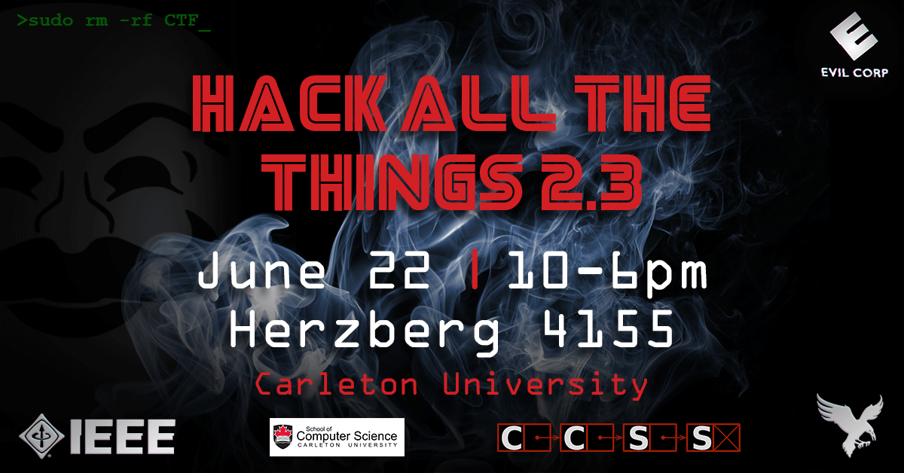

# Hack All The Things Round 2.3
## crypto
[Flip them off! | 30](https://github.com/h4tt/H4TT-2.3/tree/master/crypto/flip_them_off)

[Smartcryption | 30](https://github.com/h4tt/H4TT-2.3/tree/master/crypto/smartcryption)

[Invading Space | 40](https://github.com/h4tt/H4TT-2.3/tree/master/crypto/invading_space)

## recon
[Historic | 40](https://github.com/h4tt/H4TT-2.3/tree/master/recon/historic)

## stego
[Art | 10](https://github.com/h4tt/H4TT-2.3/tree/master/stego/art)

[Skrill Nye the Wubdubs Guy | 30](https://github.com/h4tt/H4TT-2.3/tree/master/stego/skrill_nye_the_wubdubs_guy)

[Text | 30](https://github.com/h4tt/H4TT-2.3/tree/master/stego/text)

[Split The Atom | 35](https://github.com/h4tt/H4TT-2.3/tree/master/stego/split_the_atom)

[Nothing To See Here | 50](https://github.com/h4tt/H4TT-2.3/tree/master/stego/nothing_to_see_here)

[Out of the Blue | 100](https://github.com/h4tt/H4TT-2.3/tree/master/stego/out_of_the_blue)

